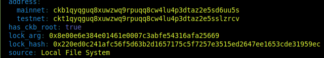
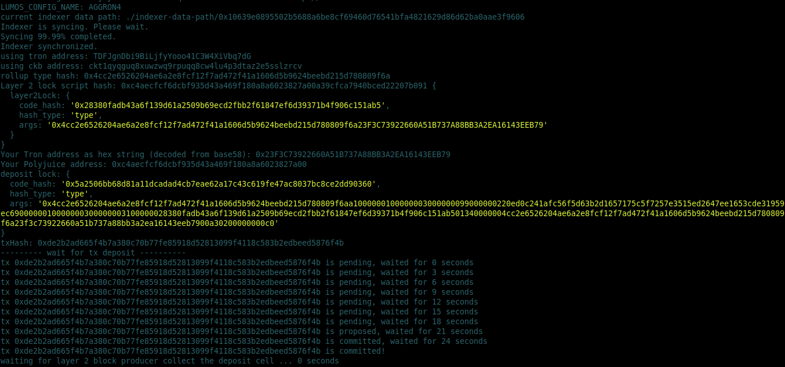
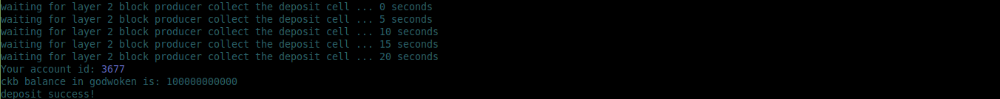
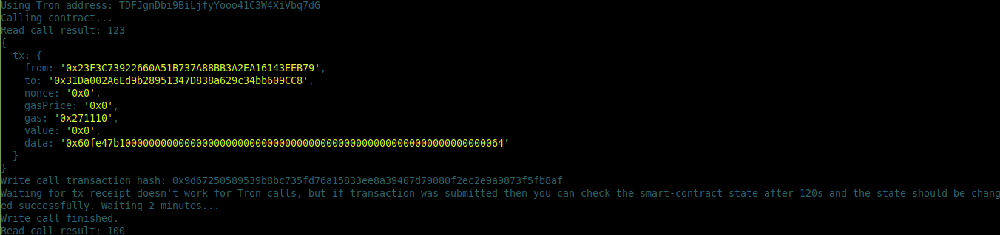

# Task 11: Tron Wallet to Execute Call

1) Accounts picture:



2) Layer 1 Address Link:
https://explorer.nervos.org/aggron/address/ckt1qyqguq8xuwzwq9rpuqq8cw4lu4p3dtaz2e5sslzrcv

3) Picture of CKByte Deposit to Tron on Layer 2:




4) Picture of Smart contract call on Layer 2:



5) Transaction hash of the call:
```
0x9d67250589539b8bc735fd76a15833ee8a39407d79080f2ec2e9a9873f5fb8af
```

6) The contract address:
```
0x31Da002A6Ed9b28951347D838a629c34bb609CC8
```

7) ABI:
```

    {
      "inputs": [],
      "stateMutability": "payable",
      "type": "constructor"
    },
    {
      "inputs": [
        {
          "internalType": "uint256",
          "name": "x",
          "type": "uint256"
        }
      ],
      "name": "set",
      "outputs": [],
      "stateMutability": "payable",
      "type": "function"
    },
    {
      "inputs": [],
      "name": "get",
      "outputs": [
        {
          "internalType": "uint256",
          "name": "",
          "type": "uint256"
        }
      ],
      "stateMutability": "view",
      "type": "function"
    }
]
```

8) Tron Address:
```
TDFJgnDbi9BiLjfyYooo41C3W4XiVbq7dG
```
