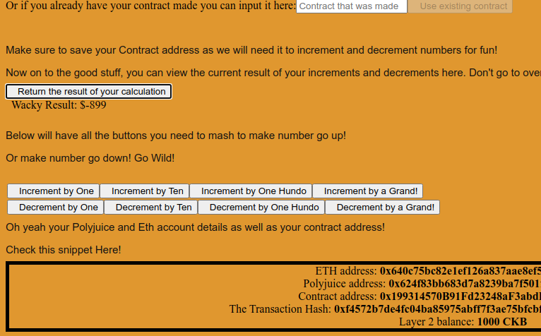

# Task 7 - Port An Existing Ethereum DApp To Polyjuice
---
## 1) Screenshot of Application on Godwoken:



---
## 2) Link to Gitub Repository:

https://github.com/lutpin1/NervosDapp
---
## 3) Transaction Hash of Deployment Transaction:
```
0xf4572b7de4fc04ba85975abff7f3ae75bfcbf44d31b06a4b617dde3d709f615b
```
---
## 4) Deployed Contract Address:
```
0x199314570B91Fd23248aF3abdBE241b1c1115a6E
```
## 5) ABI:
```
[
    {
      "inputs": [],
      "stateMutability": "payable",
      "type": "constructor"
    },
    {
      "inputs": [],
      "name": "increment1",
      "outputs": [],
      "stateMutability": "payable",
      "type": "function"
    },
    {
      "inputs": [],
      "name": "increment10",
      "outputs": [],
      "stateMutability": "payable",
      "type": "function"
    },
    {
      "inputs": [],
      "name": "increment100",
      "outputs": [],
      "stateMutability": "payable",
      "type": "function"
    },
    {
      "inputs": [],
      "name": "increment1000",
      "outputs": [],
      "stateMutability": "payable",
      "type": "function"
    },
    {
      "inputs": [],
      "name": "decrement1",
      "outputs": [],
      "stateMutability": "payable",
      "type": "function"
    },
    {
      "inputs": [],
      "name": "decrement10",
      "outputs": [],
      "stateMutability": "payable",
      "type": "function"
    },
    {
      "inputs": [],
      "name": "decrement100",
      "outputs": [],
      "stateMutability": "payable",
      "type": "function"
    },
    {
      "inputs": [],
      "name": "decrement1000",
      "outputs": [],
      "stateMutability": "payable",
      "type": "function"
    },
    {
      "inputs": [],
      "name": "result",
      "outputs": [
        {
          "internalType": "int256",
          "name": "",
          "type": "int256"
        }
      ],
      "stateMutability": "view",
      "type": "function"
    }
  ]
```

