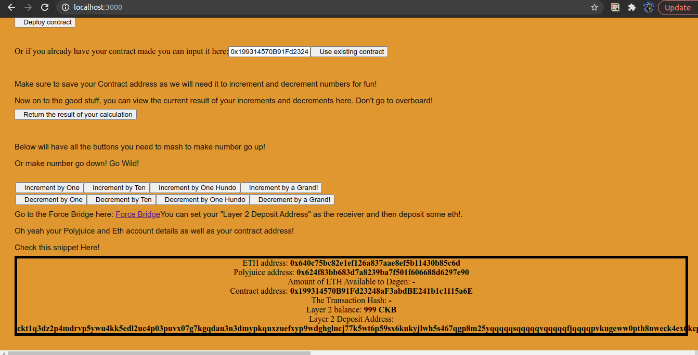
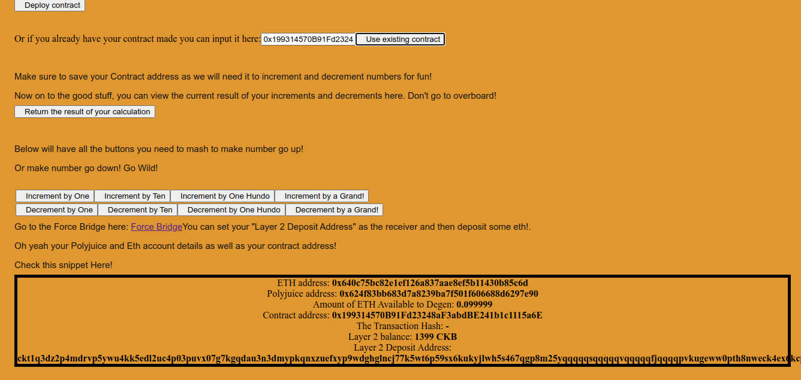

# Task 8: Modify The Ported DApp So It Supports Ethereum Assets Via Force Bridge

1) A screenshot or video of your EVM application on Layer 2 with Force Bridge support.




2) The address of the SUDT-ERC20 Proxy Contract that you deployed.
```
0x03d0D651Cf20B3D23e8141B320b01dB07806a845
```

3) A link to the GitHub repository with your EVM application that integrates Force Bridge support.
